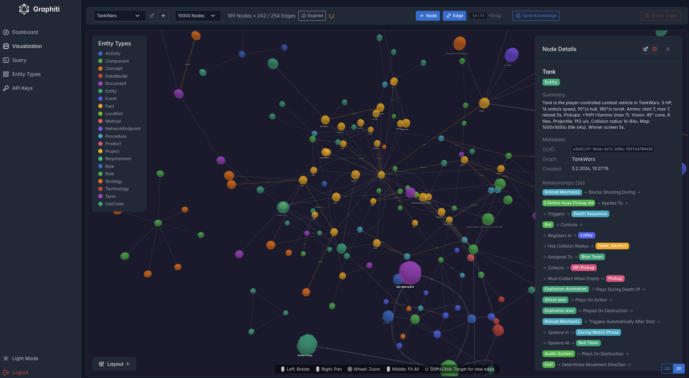

# Graphiti UI

Admin interface for the [Graphiti](https://github.com/getzep/graphiti) knowledge graph framework. Manage, visualize, and query your knowledge graphs through an interactive web UI.

This project is 100% AI-generated code (vibe-coding with [Claude](https://claude.ai)).



## Features

- **Dashboard** — Service status overview (LLM, Embedder, MCP Server, FalkorDB), MCP configuration snippet for clients
- **Graph Visualization** — Interactive force-directed graph (2D/3D) with node/edge editing, entity type legend, and Shift+Click edge creation
- **Cypher Query Editor** — Run queries against your graph database with selectable graph targets
- **Entity Types** — View and edit entity type definitions used for LLM-based knowledge extraction
- **API Keys** — Create and manage API keys for MCP server access
- **Knowledge Ingestion** — Send text to the LLM for automatic entity/relationship extraction

## Using the UI

### First Login

On first start, you'll be prompted to set an admin password. After that, log in with the configured username (default: `admin`) and your password.

### Visualization

The main workspace. Select a graph from the dropdown at the top, then explore:

- **Left-click** a node to view its details in the sidebar (attributes, connections, episodes)
- **Right-click + drag** to pan the view
- **Scroll wheel** to zoom, **middle-click** to fit all nodes
- **Shift+Click** on a second node to create a new edge between two selected nodes
- **Node / Edge buttons** to create entities directly (without LLM)
- **Send Knowledge** to submit text for LLM-based extraction into the graph
- Toggle between **2D and 3D** rendering modes
- Adjust **label visibility**, **gravity**, and **node size** with the sliders

### Dashboard

Shows the health status of all connected services and provides the MCP configuration JSON that clients need to connect.

### Entity Types

View the entity type schema that guides LLM extraction. Edit field definitions, add new types, or reset to defaults from the config file.

### API Keys

Generate API keys for authenticating MCP clients. Keys are shown once at creation — copy them immediately.

## Installation

### Prerequisites

- Docker and Docker Compose
- A running [Graphiti MCP Server](https://github.com/Brusdeylins/graphiti) (or the upstream [getzep/graphiti](https://github.com/getzep/graphiti))
- An LLM endpoint (OpenAI-compatible: OpenAI, Ollama, etc.)

### Quick Start with Docker Compose

```bash
# Clone the repo
git clone https://github.com/Brusdeylins/graphiti-ui.git
cd graphiti-ui

# Prepare environment
cp .env.example .env
# Edit .env with your API keys and settings

# Start the full stack (FalkorDB + MCP Server + UI)
docker compose -f docker-compose.example.yml up -d

# Open browser
open http://localhost:8080
```

### Production Build

```bash
# Build the Docker image
./build.sh

# Or manually
docker build -t graphiti-ui:latest .
```

The Docker image installs [graphiti-core](https://github.com/Brusdeylins/graphiti) directly from the `main` branch of the Brusdeylins fork. To use a different branch or the upstream package, edit the `RUN uv pip install` line in the `Dockerfile`.

## Tech Stack

### Frontend

| Component | Technology |
|-----------|------------|
| Framework | React 19 + TypeScript |
| Build Tool | Vite |
| UI Framework | [Tabler](https://tabler.io) (Bootstrap 5) |
| Icons | @tabler/icons-react |
| Graph Rendering | react-force-graph (2D/3D, WebGL) |
| HTTP Client | Axios |

### Backend

| Component | Technology |
|-----------|------------|
| Framework | FastAPI (Python 3.11) |
| ASGI Server | Uvicorn |
| Validation | Pydantic |
| Auth | JWT (python-jose) |
| Knowledge Graph | [graphiti-core](https://github.com/Brusdeylins/graphiti) |

### Infrastructure

| Component | Technology |
|-----------|------------|
| Graph Database | [FalkorDB](https://github.com/FalkorDB/FalkorDB) (Redis-based) |
| MCP Server | [Brusdeylins/graphiti](https://github.com/Brusdeylins/graphiti) |
| Container | Docker (multi-stage build) |

## Environment Variables

| Variable | Description | Default |
|----------|-------------|---------|
| **API Endpoints** | | |
| `GRAPHITI_MCP_URL` | MCP server URL (internal) | `http://graphiti-mcp:8000` |
| `GRAPHITI_MCP_EXTERNAL_URL` | MCP server URL (external, for display) | `http://localhost:8000` |
| `GRAPHITI_MCP_CONTAINER` | Container name for restart | `graphiti-mcp` |
| `FALKORDB_BROWSER_URL` | FalkorDB browser URL | `http://localhost:3000` |
| **FalkorDB** | | |
| `FALKORDB_HOST` | Hostname | `falkordb` |
| `FALKORDB_PORT` | Port | `6379` |
| `FALKORDB_PASSWORD` | Redis auth password | _(empty)_ |
| `FALKORDB_DATABASE` | Graph name | `graphiti` |
| **LLM / Embedding** | | |
| `OLLAMA_API_URL` | OpenAI-compatible API URL | `http://localhost:11434/v1` |
| `OLLAMA_API_KEY` | API key | `sk-ollama` |
| `LLM_MODEL` | LLM model name | `claude` |
| `EMBEDDING_MODEL` | Embedding model | `nomic-embed-text` |
| `EMBEDDING_DIM` | Vector dimensions | `768` |
| **Auth** | | |
| `ADMIN_USERNAME` | Admin username | `admin` |
| `SECRET_KEY` | JWT signing key | _(auto-generated)_ |
| `JWT_EXPIRE_MINUTES` | Session timeout | `480` (8h) |
| **Config** | | |
| `CONFIG_PATH` | Path to config.yaml | `/config/config.yaml` |
| `DEBUG` | Debug mode | `false` |

## Directory Structure

```
graphiti-ui/
├── Dockerfile                  # Multi-stage Docker build
├── build.sh                    # Build script
├── pyproject.toml              # Python dependencies
├── .env.example                # Environment variable template
├── docker-compose.example.yml  # Local development stack
├── frontend/                   # React frontend (TypeScript)
│   └── src/
│       ├── components/         # Layout, ForceGraphVisualization
│       ├── pages/              # Dashboard, Visualization, Query, ...
│       ├── contexts/           # Auth, Theme
│       └── api/                # Axios HTTP client
└── src/                        # FastAPI backend (Python)
    ├── api/                    # Route handlers
    ├── auth/                   # JWT authentication
    ├── models/                 # Pydantic models
    └── services/               # Business logic
```

## Links

- [Graphiti Framework (fork)](https://github.com/Brusdeylins/graphiti)
- [Graphiti (upstream)](https://github.com/getzep/graphiti)
- [FalkorDB](https://github.com/FalkorDB/FalkorDB)
- [Tabler UI](https://tabler.io/)
- [MCP Specification](https://modelcontextprotocol.io/)

## License

MIT
